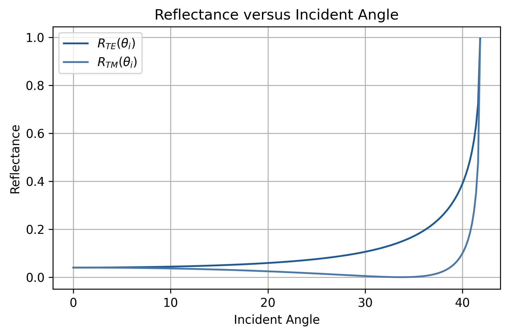

# From Maxwell's Equations to Programmable Photonic Circuits

A physics-based numerical study connecting classical electromagnetism, wave optics, guided-wave photonics, and programmable photonic circuits through analytical and reduced-order numerical models.

> **Project status:** The electromagnetic and wave-optics foundations have been completed through Notebook 08. The next stage begins with dielectric waveguide modes.

## Project Overview

This independent study project develops a computational understanding of integrated photonics by following the progression

```text
Maxwell's equations
→ electromagnetic waves
→ dielectric interfaces
→ interference and polarization
→ dielectric waveguide modes
→ coupled-mode theory
→ Mach–Zehnder interferometers
→ programmable photonic circuits
```

The purpose is not to build a general-purpose full-wave simulator. Instead, the project uses analytical solutions and reduced-order numerical models to understand the physical mechanisms underlying photonic components and to determine where each approximation is valid.

## Current Status

The project is currently transitioning from electromagnetic and wave-optics foundations to guided-wave photonics.

| Stage | Topic | Status |
|---|---|---|
| 00 | Mathematical foundations | In progress |
| 01–03 | Electrostatics, potential, conductors, and dielectrics | Completed |
| 04–05 | Magnetostatics, magnetic forces, and materials | Completed |
| 06 | Maxwell's equations and electromagnetic induction | Completed |
| 07 | Electromagnetic waves and dielectric interfaces | Completed |
| 08 | Superposition, polarization, interference, and Jones matrices | Completed |
| 09 | Dielectric slab waveguide modes | Planned |
| 10 | Directional couplers and coupled-mode theory | Planned |
| 11 | Mach–Zehnder interferometers and programmable photonic circuits | Planned |

Here, “completed” means that the main conceptual study and numerical cases have been executed and interpreted. Repository-level automated testing and documentation are still being expanded.

## Research Questions

The project is organized around the following questions:

1. How do Maxwell's equations lead to propagating electromagnetic waves?
2. How do material properties and boundary conditions determine reflection, refraction, and evanescent fields?
3. How do amplitude and relative phase determine interference and polarization?
4. How do dielectric structures confine light and determine guided modes?
5. How does evanescent overlap produce power transfer between nearby waveguides?
6. How can couplers and phase shifters be combined into programmable photonic circuits?

## Methodology

Each notebook follows a common structure:

1. State a physical question.
2. Define the model, geometry, and assumptions.
3. derive or identify an analytical reference.
4. Implement a numerical model using reusable functions where appropriate.
5. Compare numerical and analytical results quantitatively.
6. Examine conservation laws, limiting behavior, or convergence.
7. Interpret the result and state the model's limitations.

Reusable calculations are collected in [`notebooks/src`](notebooks/src), while notebook-specific experiments remain in the corresponding notebook.

## Completed Work

### Electromagnetic foundations

The first stage develops the transition from electrostatics and magnetostatics to the full Maxwell equations.

Representative studies include:

- electric fields and potentials generated by point charges;
- verification of $\mathbf{E}=-\nabla V$;
- dielectric screening and layered capacitors;
- numerical Biot–Savart integration;
- convergence of a finite wire toward the infinite-wire limit;
- the magnetic dipole approximation of a current loop;
- Maxwell's displacement-current correction;
- derivation of the electromagnetic wave equation.

### Electromagnetic waves and dielectric interfaces

[Notebook 07](notebooks/07_electromagnetic_waves_and_dielectric_interfaces.ipynb) examines:

- electromagnetic waves in dielectric media;
- the Poynting vector and time-averaged intensity;
- phase matching and Snell's law;
- TE and TM Fresnel coefficients;
- Brewster and critical angles;
- total internal reflection;
- evanescent decay and penetration depth.

Power conservation is evaluated using $\epsilon_{\mathrm{power}}=\left|R+T-1\right|$$



### Interference, polarization, and Jones matrices

[Notebook 08](notebooks/08_wave_superposition_polarization_and_interference.ipynb) connects complex electromagnetic fields with measurable optical intensity.

The numerical cases examine:

- two-wave interference as a function of relative phase;
- interference visibility under amplitude imbalance;
- linear, circular, and elliptical polarization;
- Jones-vector representations;
- phase retardation using Jones matrices;
- analyzer projection and Malus's law;
- norm conservation under lossless unitary transformations.

Representative verification results include:

$$max\left|I_{\mathrm{numerical}}-I_{\mathrm{analytical}}\right|
\approx 8.88\times10^{-16},$$

and

$$\max\left|I_{\mathrm{analyzer}}-I_{\mathrm{Malus}}\right|
\approx 4.44\times10^{-16}.$$

These results establish the phase-to-intensity and matrix-transformation framework required for later Mach–Zehnder interferometer models.

## Numerical Verification

The project uses several forms of verification:

- comparison with analytical reference solutions;
- absolute and relative error;
- conservation of power or energy;
- limiting-case analysis;
- numerical convergence;
- invariance under unitary transformations;
- comparison of complex magnitude and phase.

Common verification functions are implemented in [`notebooks/src/verification.py`](notebooks/src/verification.py).

Notebook-level verification is already used throughout the project. A repository-level automated test suite is under development in [`tests`](tests).

## Repository Structure

```text
.
├── notebooks/       # Conceptual studies and numerical experiments
│   └── src/         # Reusable numerical and verification functions
├── figures/         # Selected figures exported from the notebooks
├── tests/           # Repository-level automated tests
├── docs/            # Project scope, roadmap, conventions, and errata
├── references/      # Primary textbooks and additional sources
├── daily_logs/      # Chronological research and development notes
├── requirements.txt
├── CHECKLIST.md
└── README.md
```

## Installation

The current notebook outputs were generated using Python 3.14.3.

Clone the repository:

```bash
git clone https://github.com/hyerim1212/maxwell-to-programmable-photonics.git
cd maxwell-to-programmable-photonics
```

Create a virtual environment:

```bash
python -m venv .venv
```

On Windows:

```powershell
.venv\Scripts\activate
```

On macOS or Linux:

```bash
source .venv/bin/activate
```

Install the required packages:

```bash
python -m pip install --upgrade pip
pip install -r requirements.txt
```

Start Jupyter:

```bash
jupyter lab
```

The notebooks should be executed in numerical order when their conceptual dependencies matter. Individual notebooks may also be run independently when their required functions are available in `notebooks/src`.

## Scope and Limitations

The current project primarily considers:

- classical electromagnetic fields;
- linear materials;
- isotropic and nonmagnetic media unless otherwise stated;
- monochromatic or harmonic fields;
- lossless models in most numerical cases;
- analytical and reduced-order numerical models.

The current repository does not yet provide:

- a general-purpose full-wave electromagnetic solver;
- three-dimensional device simulation;
- fabrication-aware photonic design rules;
- nonlinear or quantum-optical models;
- a complete automated test suite;
- experimentally calibrated device parameters.

These limitations define the intended scope of the present stage rather than claims about the final project.

## References

Primary references are listed in [`references/README.md`](references/README.md). They currently include textbooks on electrodynamics, optics, integrated photonics, and silicon photonics.

## License

This project is distributed under the terms provided in [`LICENSE`](LICENSE).
